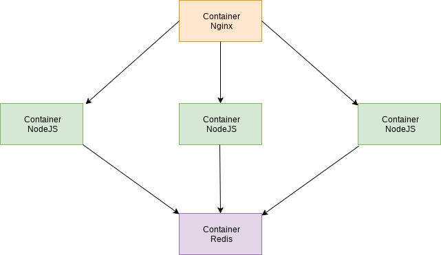

# NodeJS, Redis, Nignx y Docker

A simple Node.js application that increments a counter stored on Redis.
I want to run Redis and the node application independently as I want to have
the ability to scale the node application depending on the load.

Exists 3 instances of the node server running the application and Nginx server
in front of node for load balancing the node instances.




## Start
```
sudo docker-compose up
```

```
curl localhost // test
{ healthy: true } // response
```

```
curl localhost/clients // test

This page has been viewed 1 times! // response

curl localhost/clients // test

This page has been viewed 2 times! // response
...
```
